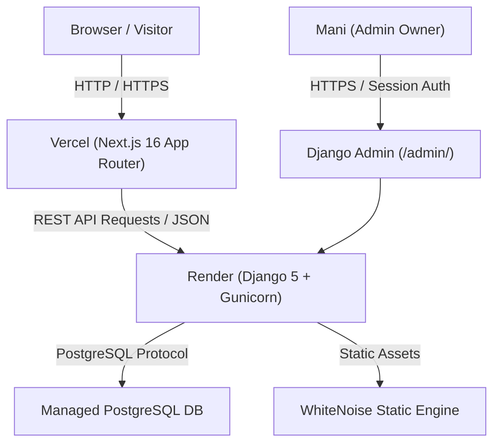

# 00 — PROJECT MAP

## Overview
This document outlines the complete codebase architecture and file system mapping for the **Mani — Engineering Portfolio Platform**. It describes the repository layout, component boundaries, and relationship between the Next.js frontend, Django REST backend, PostgreSQL database, and cloud hosting infrastructure.

---

## Architecture Map



---

## Directory & File Structure

```text
c:\Users\hp\Desktop\my_portfolio/
├── .gitignore                      # Monorepo gitignore (ignores .venv, .env, node_modules, build outputs)
├── docs/                           # Comprehensive system documentation (25 files)
├── mani-portfolio-docs/            # Initial architectural specification & requirements
├── backend/                        # Django REST Framework Backend
│   ├── .env.example                # Backend environment variable template
│   ├── build.sh                    # PaaS production build script (pip install, collectstatic, migrate, seed_data, bootstrap_admin)
│   ├── Procfile                    # Production WSGI process definition (gunicorn config.wsgi:application)
│   ├── manage.py                   # Django CLI management entrypoint
│   ├── requirements.txt            # Python production dependencies (Django, DRF, psycopg2-binary, gunicorn, whitenoise)
│   ├── config/                     # Core Django Configuration Module
│   │   ├── __init__.py
│   │   ├── asgi.py                 # ASGI configuration
│   │   ├── wsgi.py                 # Production WSGI callable (`application`)
│   │   ├── urls.py                 # Root URL routing (`/admin/`, `/api/v1/`)
│   │   └── settings/               # Environment-Aware Django Settings Engine
│   │       ├── __init__.py         # Imports production or development settings based on `DJANGO_ENV`
│   │       ├── base.py             # Base settings (Apps, Middleware, REST Framework, CORS, Security headers, STORAGES)
│   │       ├── development.py      # Local development settings (`DEBUG = True`, console email backend)
│   │       └── production.py       # Production security overrides (`DEBUG = False`, SSL, HSTS, Secure cookies)
│   └── apps/                       # Modular Django Application Domain Models
│       ├── core/                   # Core shared utilities, permissions, renderers, pagination, management commands
│       │   ├── management/commands/# Custom CLI Commands: `bootstrap_admin.py`, `seed_data.py`
│       │   ├── tests/              # Backend Test Suite (59+ unit tests)
│       │   │   ├── test_admin_and_db.py
│       │   │   ├── test_bootstrap_admin.py
│       │   │   ├── test_content_visibility.py
│       │   │   ├── test_health.py
│       │   │   ├── test_performance.py
│       │   │   ├── test_permissions.py
│       │   │   ├── test_profile_api.py
│       │   │   ├── test_projects_api.py
│       │   │   ├── test_research_api.py
│       │   │   ├── test_security.py
│       │   │   └── test_seed_data.py
│       │   ├── exceptions.py       # Custom DRF exception handler
│       │   ├── models.py           # User model (AbstractUser), TimeStampedModel, SiteSetting
│       │   ├── pagination.py       # Custom PortfolioPagination (envelope response)
│       │   ├── permissions.py      # `IsAdminUserOrReadOnly`, `PublishedOnlyQuerySetMixin`
│       │   ├── renderers.py        # `StandardJSONRenderer` ({ status, data, meta })
│       │   ├── urls.py             # Router mapping for `/api/v1/`
│       │   └── views.py            # Health, Search, Home aggregate views
│       ├── profile/                # Profile, SocialLink, Resume domain models & views
│       ├── projects/               # ProjectCategory, Technology, Project, ProjectMedia, ProjectLink, ProjectRelationship
│       ├── research/               # ResearchCategory, Research, Dataset, Experiment, ExperimentResult, Publication
│       ├── skills/                 # Skill domain models & views
│       ├── experience/             # Experience domain models & views
│       ├── education/              # Education domain models & views
│       ├── achievements/           # Achievement domain models & views
│       └── contact/                # ContactMessage model & admin interface
└── frontend/                       # Next.js 16 App Router Frontend
    ├── .env.example                # Frontend environment variable template
    ├── .env.local                  # Local environment file (`NEXT_PUBLIC_API_URL`)
    ├── next.config.ts              # Next.js configuration
    ├── package.json                # React 19, Next.js 16, Three.js, Framer Motion dependencies
    ├── tsconfig.json               # Strict TypeScript configuration
    ├── app/                        # App Router Pages & Routes
    │   ├── layout.tsx              # Root HTML & body wrapper (Navigation, Footer)
    │   ├── page.tsx                # Home page (`/`)
    │   ├── about/page.tsx          # About page (`/about`)
    │   ├── projects/               # Projects listing & dynamic slug routes
    │   │   ├── page.tsx            # Projects page (`/projects`)
    │   │   └── [slug]/page.tsx     # Project detail page (`/projects/[slug]`)
    │   ├── research/               # Research listing & dynamic slug routes
    │   │   ├── page.tsx            # Research page (`/research`)
    │   │   └── [slug]/page.tsx     # Research detail page (`/research/[slug]`)
    │   ├── journey/page.tsx        # Journey timeline page (`/journey`)
    │   ├── resume/page.tsx         # Resume page (`/resume`)
    │   ├── contact/page.tsx        # Contact form page (`/contact`)
    │   └── not-found.tsx           # Custom 404 page
    ├── components/                 # Reusable UI Design System & Components
    │   ├── 3d/                     # Three.js / React Three Fiber interactive components (`HeroScene`, `ContentGraph`)
    │   ├── contact/                # `ContactForm`, `ContactInfo`
    │   ├── feedback/               # `EmptyState`, `ErrorState`, `LoadingState`
    │   ├── home/                   # `Hero`, `FeaturedProjects`, `PhilosophyDataToggle`, `CurrentFocus`
    │   ├── journey/                # `Timeline`
    │   ├── layout/                 # `Navigation`, `Footer`, `PageContainer`, `Section`
    │   ├── motion/                 # Framer Motion animation wrappers (`FadeIn`, `FadeUp`, `Magnetic`, `Parallax`)
    │   ├── projects/               # `ProjectCard`, `ProjectGrid`, `ProjectDetailView`, `ProjectsContainer`
    │   ├── research/               # `ResearchCard`, `ResearchDetailView`
    │   └── ui/                     # Primitives (`Button`, `Input`, `Textarea`, `Badge`, `TechnologyTag`, `SectionHeading`)
    ├── lib/                        # Data access abstraction & API client
    │   ├── api/                    # API client (`client.ts`), getters (`index.ts`), normalizers (`normalizers.ts`), types (`types.ts`)
    │   └── data/                   # Unified Data Access Layer (`getProjects`, `getResearch`, `getProfile`, etc.)
    ├── content/                    # Local static fallback data files (`profile.ts`, `projects.ts`, `research.ts`, `skills.ts`, etc.)
    └── types/                      # TypeScript domain types (`portfolio.ts`)
```

---

## Component Boundaries & Relationships

1. **Frontend Access Layer (`frontend/lib/data/index.ts`)**:
   - Acts as the primary entrypoint for Next.js pages and components.
   - Invokes `frontend/lib/api/index.ts` functions.
   - Normalizes raw DRF REST API responses into strongly-typed frontend objects (`Profile`, `Project`, `Research`, etc.).
   - Falls back to local static files in `@/content/` strictly when API requests encounter network or connection failures.

2. **Backend REST API Namespace (`/api/v1/`)**:
   - Exposes public read-only endpoints for published content.
   - Wraps output using `StandardJSONRenderer` into `{ status: "success", data: ..., meta: ... }`.
   - Protects administrative write calls using `IsAdminUserOrReadOnly` (HTTP 403 Forbidden for unauthenticated write attempts).
   - Enforces `PublishedOnlyQuerySetMixin` to automatically filter out draft (`published=False` / `active=False`) items for public requests.

3. **Deployment Boundaries**:
   - **Frontend**: Deployed to Vercel (`https://mani-portfolio1.vercel.app`).
   - **Backend**: Deployed to Render (`https://mani-portfolio-api.onrender.com`).
   - **Database**: Managed PostgreSQL.
